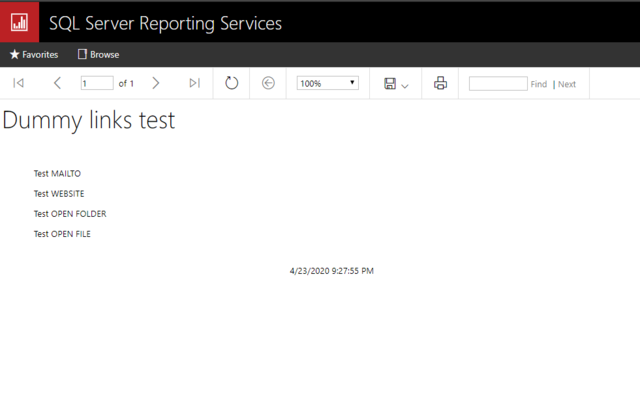

( **English** )

# Enable local file links
Unlike IE, Chrome can not open a link to a local file (file://).
This extension allows you to open a local file link.

# window.open from the iframe
Chrome blocks all the window.open that are click from the frame over the cross domain.
This extension allows you to open the window.

1. Click link to local file. 
    
1. The file opens.

# Chrome Store
https://chrome.google.com/webstore/detail/redrain-access-local-file/cnaknjccacfkfiadnoehebjdaapckljf

# Original Extension
https://github.com/tksugimoto/chrome-extension_open-local-file-link

Original chrome extension only allowed to open the local links. I have modified the code to execute window.open from the frame access over cross domain.

# Description for Chrome Store
[./chrome-store/description/en.txt](./chrome-store/description/en.txt)